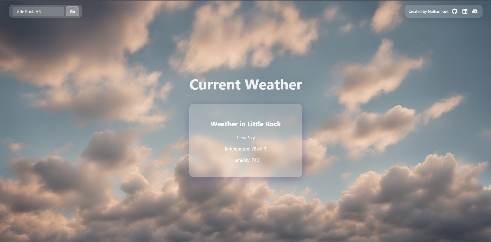

# Current Weather App

A modern, responsive weather app built with **React (Vite)** and **FastAPI**. Users can view real-time weather for their current location or search any city by name. Styled with a minimalist glassmorphism UI and built to reflect weather dynamically in both visuals and content.

---

## 📸 Screenshot



---

## 🛠 Setup Instructions

### Frontend

```bash
cd frontend
npm install
npm run dev
```

### Backend

```bash
cd backend
pip install -r requirements.txt
fastapi dev main.py
```

## ✅ Grading Requirement Map

| Requirement                           | Status | Location                                                                                              |
| ------------------------------------- | ------ | ----------------------------------------------------------------------------------------------------- |
| React + FastAPI full-stack            | ✅     | `frontend/` and `backend/` directories                                                                |
| 3–4 MVP user stories                  | ✅     | [`user-stories.md`](./user-stories.md)                                                                |
| ERD (Entity Relationship Diagram)     | ✅     | [`erd.png`](./ERD.png)                                                                                |
| Wireframes (2–4 screens)              | ✅     | [`Wireframe.excalidraw`](./Wireframe.excalidraw), [`Wireframe.png`](./Wireframe.png)                  |
| Connected frontend/backend            | ✅     | [`WeatherFetcher.jsx`](./frontend/src/components/WeatherFetcher.jsx)                                  |
| Global styling or Tailwind used       | ✅     | [`index.css`](./frontend/src/index.css)                                                               |
| Use of hooks + global state (context) | ✅     | [`CoordsContext.jsx`](./frontend/src/context/CoordsContext.jsx)                                       |
| Bonus API or library used             | ✅     | [Nominatim API](https://nominatim.org/) + [`react-icons`](https://react-icons.github.io/react-icons/) |
